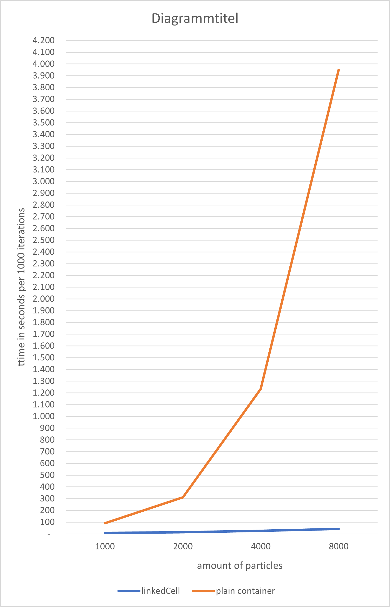

MolSim
===

The Molecular Dynamics teaching code.

# Group H #
Members:
* Samhitha Girish Jois
* Katharina Miller
* Anna Lena Müller

# Code #
* Link:     https://github.com/Kotronon/Bachelor-Praktikum
* Branch:   master
* Revision: b0246db
* Compiler: gcc 11.4.0

# Run Code #
* packages to install:
  * sudo apt install libspdlog-dev
  * sudo apt-get install libgtest-dev
  * unfortunately only using fetchContent doesn't prevent from installing them
* to run the program:
  * ./MolSim
  * due to the xml input being incomplete it is only possible at the moment to change parameters in the main method manually as well as create cuboids/disks there
  * this should be fixed in the future, log level can not be chosen either currently as this was planned to be set up completely in the xml files
  * 
* to run the tests:
  * ctest
  

# Report #
## Task 1 ##
* XML input with XSD
* Using CodeSynthesis XSD tool, generated files that parse a XML file with the help of a XSD file
* generated using this command : 
* xsd cxx-parser --generate-test-driver --generate-print-impl --force-overwrite --xml-parser expat <xsd input file>.xsd
* adding destructors manually to input-pimpl.cxx and hxx file
* linked inputnew-pimpl file to main running file MolSim.cpp
* Run the parsing with following commands : 
* c++ -std=c++11 -I.../libxsd -c newinput-driver.cxx newinput-pskel.cxx
* c++ -std=c++11 -o driver newinput-driver.o newinput-pskel.o -lexpat
* ./driver newinput.xml
* latest working version can be found on branch : origin/Aufgabe-1_XML_input_and_XSD and commit : f42de68d
* Attempt/ Idea : 
* 1. create class-specific variables in parameter classes specified in .hxx , implement simple getters to those classes in .cxx file
* 2. call getter functions in a function in MolSim.cpp and instantiate all parameters as variables
* 3. use variable definitions instead of hardcode values in function
* Linking of MolSim.cpp (main executable) to newinput-pimpl.cxx failed  due to :
* * linker error : unresolved references to variables of the respective classes
* * possible troubleshooting and debugging very extensive due to the amount of classes
* * Solution : 
* * * check all dependencies once again and enlist help of gdb
* * * read up and learn about scopes of variables
* * * trial and error
* 
## Task 2 ##
* Linked-cell algorithm
* Cell wide in each direction is the cutoff value
* Structured it to make it possible to easily determine the fitting cell for each particle based on position
* specific particle can be found with cells \[x-coordinate] \[y-coordinate] \[z-coordinate] \[index in cell]
* this structure has been changed later on for the ghost cell creation so there are extra cells around the container by moving all cells by 1 in each direction and creating more cells to use as halo cells
* 
* We still provide the possibility to use simple sum implementation
* Between the two implementations is a big time difference:

## Task 3 ##
* Boundaries
* Outflow Boundary;
  * checks if particle is out of boundary
  * deletes if it is
* Reflection Boundary
  * Mirroring:
    * just reflecting the particles like a mirror 
    * depending on surface and kind of particle physically inaccurate
  * Ghost cells
    * creating an imaginary cell to create a force from the boundary
    * has an individual influence on each particle
    * physically more accurate
    * chosen as reflection boundary in the end version

## Task 4 ##
* Sphere generation
* Two strategies for creating a 2d disk:
  * Generation with Bresenham algorithm
    * faster generation due to less expensive operations
    * center is at exact coordinates given
    * 'rounder' circles, less weird edges
    * causes problems in our simulation for some cases even though the initial generation works fine
    * probably an issue with unfixed precision errors that creates particles nearly on top of each other which causes them to shoot away from each other and out of the boundary
    * not easily expanded to 3d spheres
  * Generation with cuboid generation
    * use of already implemented cuboid generator to create a cuboid with the diameter of the disk as height and length
    * cuboid needs lower left corner coordinate, center might not be at exact given position due to precision errors
    * more expensive calculations due to the need to check the distance to center for each generated particle
    * a particle is only added to the result if the distance to the center is less or equal to the radius (with some room for precision errors)
    * can be easily expanded to 3d spheres since cuboid generation is already 3d as well
    * used in the final version

## MISC ##
* In the falling drop animation we noticed that particles tend to sometimes get stuck at the upper boundary, we did not yet manage to fix this error
* Due to some restructuring of our LinkedCellContainer we might have forgotten to change some functions accordingly